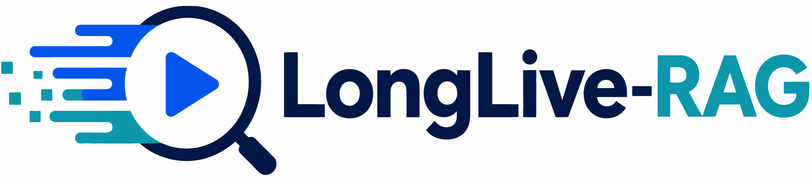
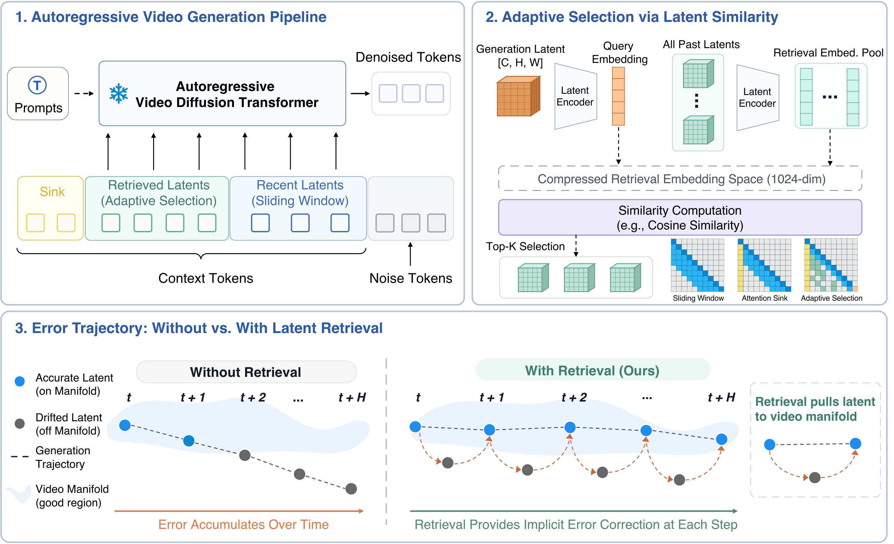

# 🔍 LongLive-RAG: A General Retrieval-Augmented Framework for Long Video Generation

[](https://arxiv.org/abs/2606.02553)
[](https://github.com/qixinhu11/LongLive-RAG)
[](https://longlive-rag.github.io/)
[](https://deepwiki.com/qixinhu11/LongLive-RAG)
[](https://huggingface.co/qixinhu11/LongLive-RAG)
[](https://huggingface.co/papers/2606.02553)

[Qixin Hu](https://qixinhu11.github.io/) · [Shuai Yang](https://andysonys.github.io/) · [Wei Huang](https://aaron-weihuang.com/) · [Song Han](https://hanlab.mit.edu/songhan) · [Yukang Chen](https://yukangchen.com/)

## 💡 TL;DR

LongLive-RAG turns long video generation into a **retrieval problem**. Instead of attending only to the most recent sliding window, an autoregressive (AR) video generator looks back over the video it has *already* generated and pulls in the most relevant past latents as extra context. This cuts error accumulation, identity drift, and background flicker over long horizons, **without retraining the base generator**.



## 📰 News

- 🔥 [2026.06] We release the **LongLive-RAG** paper and code!

## 🎬 Demo

> 🌐 More results and video comparisons on the [**project page**](https://longlive-rag.github.io/).

Long-horizon comparisons. The **native** sliding-window baseline (left) accumulates errors and drifts over time, while adding **LongLive-RAG** (right) preserves subject identity and visual quality.

<table>
<tr>
  <th align="center">Native (baseline)</th>
  <th align="center">Native + LongLive-RAG (Ours)</th>
</tr>
<tr>
  <td><video src="https://github.com/user-attachments/assets/7049f1ec-36aa-41ee-a219-19319f23166a" controls width="100%"></video></td>
  <td><video src="https://github.com/user-attachments/assets/63a15dea-2e03-4b46-a778-96da12d7c3ab" controls width="100%"></video></td>
</tr>
<tr>
  <td><video src="https://github.com/user-attachments/assets/ec3f48c8-e014-4032-a52d-20b41d71ee7b" controls width="100%"></video></td>
  <td><video src="https://github.com/user-attachments/assets/7db25e60-ebac-4c39-8259-6eb14f85b09e" controls width="100%"></video></td>
</tr>
</table>

## ✨ Highlights

- **🥇 First of its kind.** Among open-ended AR long video generation methods, the first to formulate self-generated latent history as content-addressable retrieval memory.
- **🔌 Plug-and-play.** Works across Causal-Forcing, Self-Forcing, and LongLive with the base generator frozen.
- **🔎 Searchable history.** Retrieves the most relevant past latents as extra context for each new block.
- **📐 Window Temporal Delta Loss.** Makes embeddings capture meaningful temporal change, not redundant local similarity.
- **⚡ Consistent wins.** Best average VBench-Long rank across lengths and backbones.

## 🔬 Method Overview

At block `t`, a standard AR model attends to a sliding-window context. LongLive-RAG inserts **retrieved historical entries** `M_t` between the sink and local windows:

```
Sliding window:   A_sw  = [ C_sink ‖           C_loc ]
LongLive-RAG:     A_rag = [ C_sink ‖  M_t  ‖   C_loc ]
```

| Stage | What happens |
|---|---|
| **1. Indexing** | Encode each completed latent block into a compact embedding and store it. |
| **2. Retrieval** | Match the current block against past embeddings and pull in the top-K as extra context. |
| **3. Embedding training** | Train the encoder offline on self-generated latents, with the base generator frozen. |

## 🏁 Getting Started

### 📦 Installation

LongLive-RAG shares its environment with LongLive. Just follow the upstream [**LongLive installation guide**](https://nvlabs.github.io/LongLive/LongLive2/docs/#installation).

### 🚀 Inference

**1. Download everything — two commands.** All LongLive-RAG assets (AR backbones, retrieval AE, prompt files, and the toy latent set) live in a single Hugging Face repo; the base WAN VAE comes from Wan:

```bash
# Base WAN VAE — LongLive-RAG operates in its latent space
hf download Wan-AI/Wan2.1-T2V-1.3B --local-dir wan_models/Wan2.1-T2V-1.3B

# All LongLive-RAG assets — restores checkpoints/ and toydatasets/ in place
hf download qixinhu11/LongLive-RAG --local-dir . --include "checkpoints/*" "toydatasets/*"
```

> Older setups can swap `hf download` for `huggingface-cli download` (same arguments).

The second command lays out:

```
checkpoints/
├── causal_forcing.pt              # Causal-Forcing AR backbone
├── self_forcing.pt                # Self-Forcing AR backbone
├── longlive_base.pt               # LongLive AR backbone
├── longlive_lora.pt               # LongLive LoRA (paired with longlive_base.pt)
├── ae_latent_mem.pt               # Retrieval autoencoder (default for inference)
├── moviegenbench_128_refined.txt  # 128 MovieGenBench prompts
└── vidprom_filtered_extended.txt  # Self-Forcing prompt pool (for generate_latent.py)
toydatasets/
└── latent_0000xx.pt               # tiny example latent set for the training demo
```

To train your own retrieval AE instead of using `ae_latent_mem.pt`, see [Training](#️-training).

**3. Run.** The repo ships a 3 × 2 grid (three backbones × two context-assembly methods) in [configs/](configs/):

| Backbone \ Method | `native` (sliding-window) | `latentmem` (LongLive-RAG, ours) |
|---|---|---|
| **causal_forcing** | [causal_forcing_native.yaml](configs/causal_forcing_native.yaml) | [causal_forcing_latentmem.yaml](configs/causal_forcing_latentmem.yaml) |
| **self_forcing** | [self_forcing_native.yaml](configs/self_forcing_native.yaml) | [self_forcing_latentmem.yaml](configs/self_forcing_latentmem.yaml) |
| **longlive** | [longlive_native.yaml](configs/longlive_native.yaml) | [longlive_latentmem.yaml](configs/longlive_latentmem.yaml) |

```bash
# Main result: Causal-Forcing backbone + LongLive-RAG retrieval
bash inference.sh causal_forcing latentmem

# Baselines: native sliding-window
bash inference.sh causal_forcing native

# GPU / port overrides
GPU=4 PORT=29510 bash inference.sh causal_forcing latentmem
```

### 🔁 Reproducibility

For deterministic inference, [inference.py](inference.py) sets a fixed seed (`config.seed`) across `random` / `numpy` / `torch` and enables deterministic backends:

```python
os.environ["CUBLAS_WORKSPACE_CONFIG"] = ":16:8"
os.environ.setdefault("PYTHONHASHSEED", str(config.seed))
torch.backends.cudnn.deterministic = True
torch.backends.cudnn.benchmark = False
torch.use_deterministic_algorithms(True, warn_only=True)
```

> ⚠️ **Bit-exact cross-machine reproduction is strict and hard to guarantee.** Even with the settings above, identical outputs across *different* machines require the **same GPU model**, the **same PyTorch / CUDA / cuDNN versions**, and matching checkpoints/configs. Differences in GPU architecture (e.g. A100 vs. H100), TF32 behavior, or the `torch.compile` autotuned attention kernels can still produce small numerical drift. To take `PYTHONHASHSEED` fully into effect, export it before launching: `PYTHONHASHSEED=0 bash inference.sh ...`.

> ✅ **The more reliable way to validate our gains is a same-machine A/B comparison.** Run the **native** baseline and **LongLive-RAG (`latentmem`)** back-to-back on the *same* GPU with the *same* prompts and seed, then compare the outputs directly. This isolates the effect of retrieval from any hardware/software-stack variance:
>
> ```bash
> # Same backbone, same machine — compare baseline vs. ours
> bash inference.sh causal_forcing native
> bash inference.sh causal_forcing latentmem
> ```

### 🏋️ Training

The base generator stays **frozen**; the only trainable component is the retrieval encoder (a small latent autoencoder). Training has two steps:

**Step 1: Build a latent corpus.** Run a frozen generator over a prompt pool to collect the clean latent blocks it produces; these become the training samples. The launcher shards generation across multiple GPUs.

```bash
bash generate_latent.sh
```

**Step 2: Train the retrieval autoencoder.** Fit the encoder on the collected latents with a reconstruction loss plus the Window Temporal Delta and trajectory-smoothing terms. Default hyperparameters live in [ae/configs/](ae/configs/).

```bash
bash train_ae_delta.sh
```

Retraining the base AR backbones is out of scope; backbone checkpoints are consumed as-is. See upstream [LongLive](https://github.com/NVlabs/LongLive) / [Self-Forcing](https://github.com/guandeh17/Self-Forcing) to train one from scratch.

## 🗂️ Repository Layout

```
├── ae/               # Retrieval autoencoder (model, configs, training)
├── checkpoints/      # AR backbones, AE checkpoint, prompt .txt files (gitignored)
├── configs/          # Inference YAMLs (3 backbones × 2 methods) + generate_latent
├── datasets/         # AE training latents (output of generate_latent.sh, gitignored)
├── toydatasets/      # Tiny example latent set for the training demo (from HF, gitignored)
├── pipeline/         # Causal inference pipeline (drives all backbones)
├── utils/            # Dataset, memory, scheduler, lora, wan-wrapper utilities
├── wan/, wan_models/ # WAN VAE backbone (T2V-1.3B)
├── inference.py      # Inference entry point
├── inference.sh      # Launcher: bash inference.sh <backbone> <method>
├── generate_latent.py / .sh  # Latent corpus generation (multi-GPU sharded)
└── train_ae_delta.sh         # Retrieval AE launcher
```

## 📄 Citation

📜 Paper: [arXiv:2606.02553](https://arxiv.org/abs/2606.02553)

```bibtex
@article{longliverag2026,
  title         = {LongLive-RAG: A General Retrieval-Augmented Framework for Long Video Generation},
  author        = {Hu, Qixin and Yang, Shuai and Huang, Wei and Han, Song and Chen, Yukang},
  journal       = {arXiv preprint arXiv:2606.02553},
  archivePrefix = {arXiv},
  eprint        = {2606.02553},
  year          = {2026}
}
```

## 🙏 Acknowledgements

LongLive-RAG builds on the codebases and ideas of:

- [LongLive](https://github.com/NVlabs/LongLive): the AR long-video framework this codebase forks from.
- [Self-Forcing](https://github.com/guandeh17/Self-Forcing): causal AR training recipe and prompt pool.
- [Causal-Forcing](https://github.com/thu-ml/Causal-Forcing): one of the AR backbones evaluated in this work.
- [Wan](https://github.com/Wan-Video/Wan2.1): the base video generation model and VAE latent space.

## 📝 License

Released under the [Apache 2.0](LICENSE) license.
